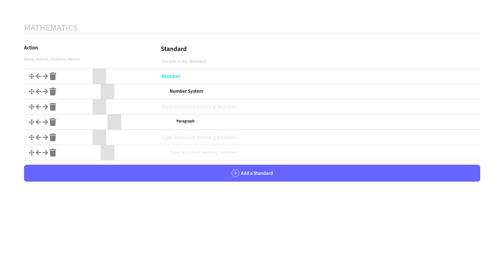

# Front-End Assessment

## Task: Create a tool for teachers to author curriculum for a subject.

### Basic functionalities:
- [x] Indent & Outdent
- [x] Delete - will delete the node along with its children
- [x] The text in each row should be editable like a text box
- [ ] Move action - Move nodes around in the curriculum using Drag-Drop or Up-Down arrow icons

### Tech Stack: Vanilla JavaScript, HTML & CSS

## Demo 

### Toddle_project
